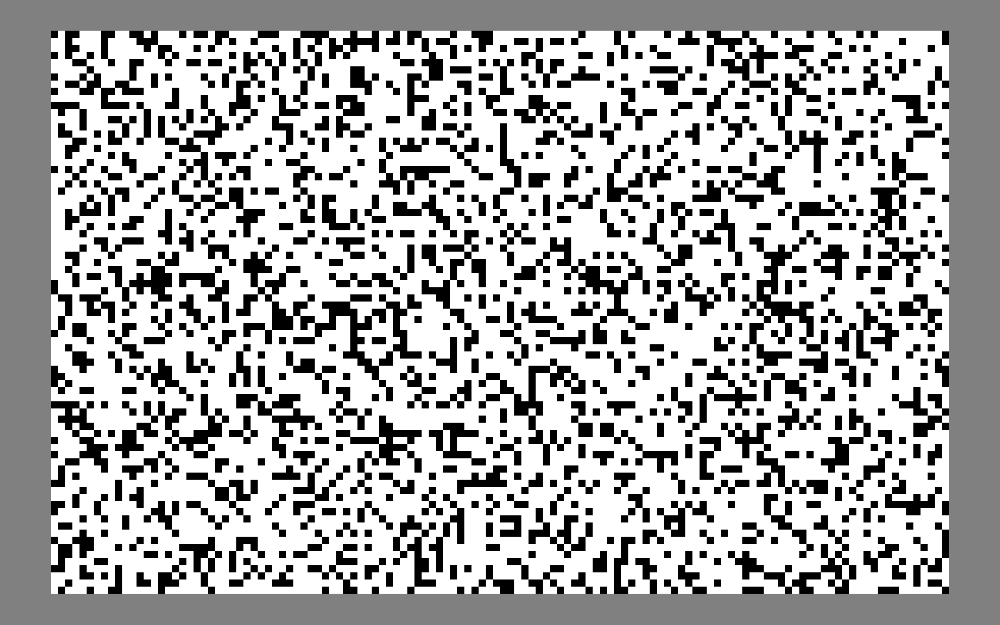

# Game_of_Life
Introduction
------------

The Game_of_Life is my adaption of Conway's Game of Life. For Ubuntu 20.04 LTS.

At the moment there is only the random generation of living elements at the begin of the program. In the future I want to add the option to add typical shapes from this kind of games by hand with the cursor. Right now only the size of the grid or rather the number of elements can be choosen, but also the FPS rate and window form.

Additional Software
-------------------
**REQUIRED**

You will need to install SFML:

	$ sudo apt-get install libsfml-dev

For more information about the library, you can read the Wikipedia aricle:

https://de.wikipedia.org/wiki/Simple_and_Fast_Multimedia_Library

Comments
--------
To create a video by yourself just uncomment the required lines in the main.cpp and create the GIF with the following command:

	$ convert -delay 30 -loop 0 $(ls -1v) Game_of_Life_Video.gif

Credits
-------

Author:  Andre Alexander Pieper.

Version 1.0

Date:  03.06.2020

License: LGPLv3
